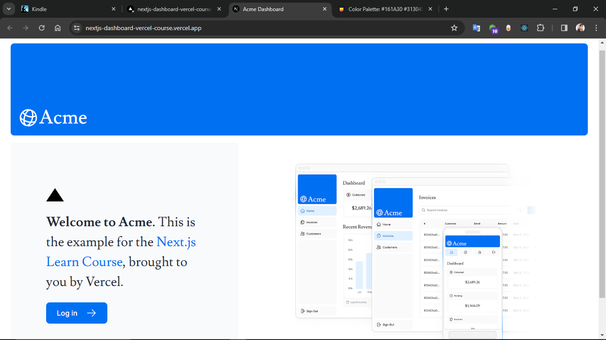
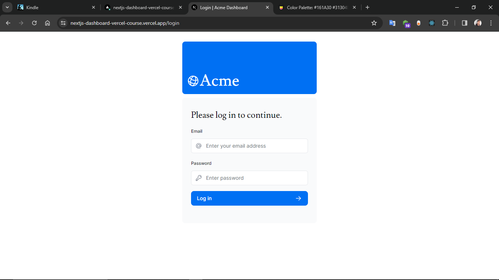
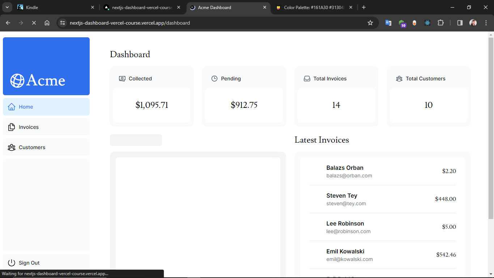
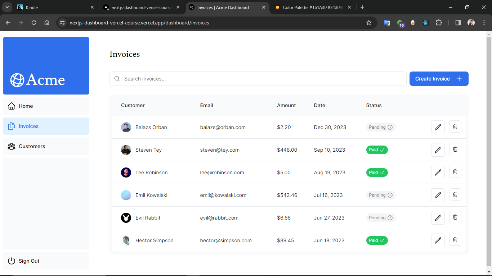

# Next.js Course - Vercel

This is a learning Next.js dashboard project from Vercel. It includes all the fundamentel needs for latest next.js 14.

And its provides the fundamentels of :

- Server actions
- Authentication
- File base routing
- Streaming
- Error handling
- MySQL integration from the vercel

## Installation

Install my-project with npm

```bash
  git clone https://github.com/kr1shh/Nextjs-dashboard-vercel-course.git

  cd Nextjs-dashboard-vercel-course

  npm Install

  npm run dev
```
    
## Tech Stack

**Client:** NextJS 14, TailwindCSS, Zod

**Backend:** Bcrypt

**Database:** MySQL


## Environment Variables

To run this project, you will need to add the following environment variables to your .env file

**# Copy from .env.local on the Vercel dashboard**

`POSTGRES_URL`

`POSTGRES_PRISMA_URL`

`POSTGRES_URL_NON_POOLING`

`POSTGRES_USER`

`POSTGRES_HOST`

`POSTGRES_PASSWORD`

`POSTGRES_DATABASE`


**# `openssl rand -base64 32`**

`AUTH_SECRET`

`AUTH_URL`


## Screenshots










